<div align="center">



<br/>

### 🇰🇷 `KR`

[](https://git.io/typing-svg)

<br/>

`Reverse Engineering`　`Security Automation`　`Game Security`　`DevSecOps`

</div>



## 🌙 About

보이지 않는 구조를 추적하고, 복잡한 보안 분석 과정을 자동화합니다.

리버스 엔지니어링과 취약점 분석을 중심으로 시스템 내부 동작을 이해하고, 반복되는 분석 과정을 도구로 구현하는 데 관심이 있습니다.

```text
[ TWILIGHT SYSTEM ]

STATUS        : ONLINE
RESEARCH MODE : ACTIVE
CORE ENGINE   : STANDBY
NEXT TARGET   : UNKNOWN
```


## 🌓 Featured Projects

<table>
<tr>
<td width="50%" valign="top">

### 🌌 Twilight

파일, 프로그램, URL 및 네트워크 데이터를 하나의 흐름에서 분석하기 위한 통합 보안 분석 프로젝트입니다.

- PE 정적 분석과 구조 해석
- 문자열·섹션·Import 분석
- 디스어셈블리 및 함수 분석
- 웹 구조와 취약 구간 시각화
- PCAP 기반 네트워크 분석
- 플러그인형 분석 모듈
- 분석 일시정지·재개·리포트 생성

</td>
<td width="50%" valign="top">

### 🪤 CoreTrap

시스템 내부에서 발생하는 비정상 행위와 보안 우회 시도를 관찰하고 탐지하기 위한 연구 프로젝트입니다.

- 시스템 행위 관찰
- 비정상 동작 탐지
- 우회 기법 분석
- 탐지 로직 설계
- 실험 환경 기반 검증
- 분석 결과 기록 및 비교

</td>
</tr>
</table>


## 🧬 Research Stack

<div align="center">


<br/><br/>


</div>


<div align="center">

### `Exploring the boundary between code and security.`

<sub>Twilight online · CoreTrap standing by</sub>

</div>